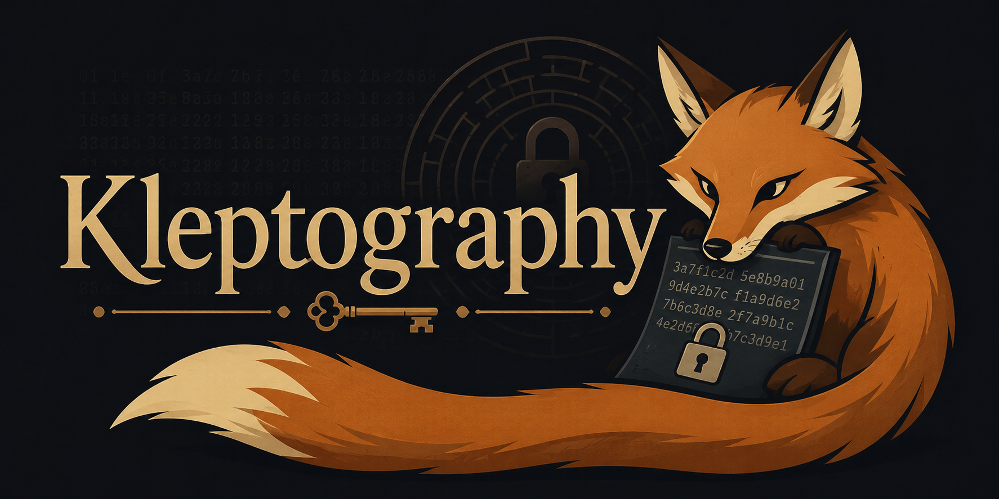

<div align="center">



# Kleptography

**Cryptography against cryptography.**

An interactive lab that shows how a cryptographic implementation can be
backdoored so that its output still looks perfectly normal, and how much an
attacker gains from it.

[](https://dpr-kleptography.streamlit.app/)

**[Try the live demo →](https://dpr-kleptography.streamlit.app/)**

[](https://github.com/danielsp13/kleptography/actions/workflows/ci.yml)


[](LICENSE)
-100%25-brightgreen)

[](https://github.com/astral-sh/uv)
[](https://github.com/astral-sh/ruff)


</div>

---

## Author

**Daniel Pérez Ruiz**, cryptography software engineer.

[GitHub](https://github.com/danielsp13) ·
[LinkedIn](https://www.linkedin.com/in/daniel-perez-ruiz)

## What is kleptography?

Kleptography, introduced by Adam Young and Moti Yung in 1997, studies
**SETUP** backdoors (*Secretly Embedded Trapdoor with Universal
Protection*): a cryptographic device is modified so that its outputs remain
indistinguishable from honest ones to everyone, yet an attacker who embedded
a public key in the device, and alone holds the matching private key, can
recover secret information from those outputs.

The point is unsettling: **the scheme is not broken, the implementation is.**
No cipher is attacked, no protocol message looks wrong, and inspecting the
device only reveals a public key that cannot be used to exploit it.

This project turns that idea into something you can run, inspect and
experiment with, step by step.

## Highlights

- **Faithful to the literature.** The Diffie-Hellman SETUP follows Young and
  Yung (EUROCRYPT '97) and keeps the paper's notation. Nothing is invented;
  every implementation choice is documented.
- **End-to-end impact, not a toy equation.** The same backdoor is placed
  inside a complete encrypted channel (ephemeral DH, a NIST KDF and
  AES-256-GCM). The attacker decrypts every session but the first, without
  ever breaking AES, which makes the paper's *(1,2)-leakage* visible at the
  application level.
- **Honest and malicious code stay apart.** The compromised device is a
  separate class and a drop-in replacement for the honest participant, never
  a hidden flag. Isolation tests check that honest code never imports the
  kleptographic packages.
- **Standard primitives, never reimplemented.** RFC 7919 groups, the
  NIST SP 800-56C one-step KDF and AES-256-GCM come from
  [`pyca/cryptography`](https://cryptography.io); the SETUP's hash is built
  on SHAKE-256 with domain separation and fixed-width encoding.
- **Nothing is hidden.** Every intermediate value (exponents, the SETUP's
  `z`, the attacker's candidates, derived keys, nonces, tags) is exposed
  through immutable value objects and shown in the interface, with the
  formula behind it.
- **Verified, not just written.** 837 tests, including hand-computed test
  vectors, the published GCM test vectors, independent recomputation of
  every KDF output, exhaustive checks over small groups, and 100% coverage
  of the cryptographic and mathematical core. Typed, linted and checked in
  CI on Python 3.12, 3.13 and 3.14.

## Interactive sections

The Streamlit application builds up from intuition to formulas to a live
experiment, written for readers without a cryptography background.

| Section | What you can do |
| --- | --- |
| **Diffie-Hellman** | Pick a toy group or an RFC 7919 group, use random or chosen keys, and follow the honest key exchange phase by phase, including what an eavesdropper sees. |
| **Young–Yung SETUP** | Learn the idea and the full derivation, then build a backdoored device, run two exchanges with an honest peer, and take the attacker's seat to recover the second shared secret from public values only. |
| **Encrypted channel** | Run 2 to 5 encrypted sessions with an honest or a compromised device, then use the attacker's workbench to recover each session key and decrypt the messages. Session 1 always stays confidential. |

## How the SETUP works

In a prime-order subgroup of a safe prime `p = 2q + 1`, the attacker holds a
private key `X` and embeds `Y = g^X mod p` and the constants `a`, `b` and
`W` in the device. The device's first exponent `c1` is honest; the next one
is derived from it:

```text
device:    z  = g^(c1 - W·t) · Y^(-a·c1 - b)  mod p     t is a random bit
           c2 = H(z)

attacker:  r  = m1^a · g^b                    mod p     m1 = g^c1, public
           z1 = m1 / r^X,   z2 = z1 / g^W     mod p
           c2 = H(z1) if g^H(z1) = m2, otherwise H(z2)
```

Since `r^X = Y^(a·c1 + b)`, only the holder of `X` can strip the mask from
`m1` and recompute `c2`. To everyone else, `m2 = g^c2` is just another
random-looking public key, and recovering `c2` would require solving the
computational Diffie-Hellman problem. The *Formulae* tab of the SETUP
section walks through the complete proof.

## Quick start

The app runs online at
[dpr-kleptography.streamlit.app](https://dpr-kleptography.streamlit.app/),
with nothing to install. To run it locally instead:

Requirements: Python 3.12 or newer and [uv](https://docs.astral.sh/uv/).

```bash
git clone https://github.com/danielsp13/kleptography.git
cd kleptography
uv sync
uv run streamlit run src/kleptography/app/main.py
```

Then open the URL that Streamlit prints (by default `http://localhost:8501`).

## Using the library

The cryptographic code does not depend on Streamlit and can be used on its
own. This script runs two key exchanges between a backdoored device and
honest peers over a standardized 2048-bit group, and lets the attacker
recover the second shared secret:

```python
from kleptography.crypto.dh.groups.rfc7919 import ffdhe2048
from kleptography.crypto.dh.participant import DiffieHellmanParticipant
from kleptography.crypto.dh.protocol import perform_key_exchange
from kleptography.crypto.dh.setup.attacker import YoungYungAttacker
from kleptography.crypto.dh.setup.participant import YoungYungDiffieHellmanParticipant

group = ffdhe2048()

# The attacker builds the backdoor and ships its public part inside a device.
attacker = YoungYungAttacker.generate(group)
configuration = attacker.generate_configuration()
device = YoungYungDiffieHellmanParticipant(group, configuration)

# Two ordinary key exchanges with honest peers. The device's exponents chain.
perform_key_exchange(device, DiffieHellmanParticipant(group))
first_public_key = device.public_key

device.generate_keypair()
bob = DiffieHellmanParticipant(group)
second = perform_key_exchange(device, bob)

# From public values only, plus the trapdoor X, the attacker gets the secret.
recovered = attacker.recover_shared_secret(
    first_public_key=first_public_key,
    second_public_key=device.public_key,
    peer_public_key=bob.public_key,
    configuration=configuration,
)
assert recovered == second.bob_shared_secret
```

Every package is documented in depth, with runnable examples and diagrams,
in the [documentation](docs/README.md).

## Project structure

```text
src/kleptography/
├── math/            Number theory: modular arithmetic, safe primes, generators
├── crypto/
│   ├── dh/          Honest Diffie-Hellman: parameters, participant, protocol,
│   │   │            tracing, RFC 7919 groups
│   │   └── setup/   Kleptographic: the Young–Yung device and attacker
│   ├── kdf/         NIST SP 800-56C one-step KDF (SHA-256)
│   ├── aead/        AES-256-GCM
│   └── channel/     Encrypted channel: ephemeral DH + KDF + AEAD sessions
│       └── setup/   Kleptographic: the channel attacker
└── app/             Streamlit interface: pages, components, educational content
```

Dependencies flow one way, `app → crypto → math`: the cryptographic core
never imports the interface. [Architecture](docs/architecture.md) explains
these rules and how honest and kleptographic code stay apart.

## Documentation

The [`docs/`](docs/README.md) folder documents the library behind the app:
what each package implements, how the pieces connect and why. Every page
has examples you can run, based on the same toy group as the tests.

| Page | Contents |
| --- | --- |
| [Architecture](docs/architecture.md) | Layers, dependencies, isolation of kleptographic code, shared conventions |
| [Number theory](docs/math.md) | Modular arithmetic, safe primes and subgroup generators |
| [Diffie-Hellman](docs/dh.md) | Parameters, participants, the five phases of the exchange, tracing, RFC 7919 groups |
| [Young–Yung SETUP](docs/setup.md) | The backdoored device, the attacker, the equations and their test vectors |
| [Primitives](docs/primitives.md) | The SP 800-56C key derivation and AES-256-GCM |
| [Encrypted channel](docs/channel.md) | Sessions, the private and public views, and the channel's attacker package |
| [Interface](docs/app.md) | How each interactive section uses the library |

<p align="center">
  
</p>

## Development

```bash
uv sync                                               # install dependencies
uv run pytest                                         # run the test suite
uv run coverage run -m pytest && uv run coverage report
uv run ruff check .                                   # lint (incl. docstrings)
uv run ruff format .                                  # format
uv run ty check                                       # type check
uv run pre-commit install                             # Ruff and ty on commit
```

CI runs linting, formatting, type checking and the test suite on every push.

## Scope and responsible use

This is an **educational and research** project. It exists to help people
understand why trusting a black-box implementation is a security
assumption, and what a backdoor that survives inspection looks like.

- Toy groups are deliberately insecure and labelled as such.
- The code is not hardened (for example, Python integers are not
  constant-time) and must not be used to protect real data.
- It is not attack tooling: the backdoor only works on a device built with
  it, and every step is exposed for study.

## Roadmap

Diffie-Hellman is the first case study. The same methodology (reference
construction, kleptographic construction, experiment, observation and
analysis) is meant to be applied to other targets, such as RSA key
generation and post-quantum schemes like ML-DSA.

## References

- A. Young and M. Yung, "Kleptography: Using Cryptography Against
  Cryptography", *EUROCRYPT '97*, LNCS 1233, pp. 62–74, Springer, 1997.
- D. Gillmor, "Negotiated Finite Field Diffie-Hellman Ephemeral Parameters
  for TLS", RFC 7919, 2016.
- NIST SP 800-56C Rev. 2, "Recommendation for Key-Derivation Methods in
  Key-Establishment Schemes", 2020.
- D. A. McGrew and J. Viega, "The Galois/Counter Mode of Operation (GCM)",
  2005.

## License

Released under the [MIT License](LICENSE).
