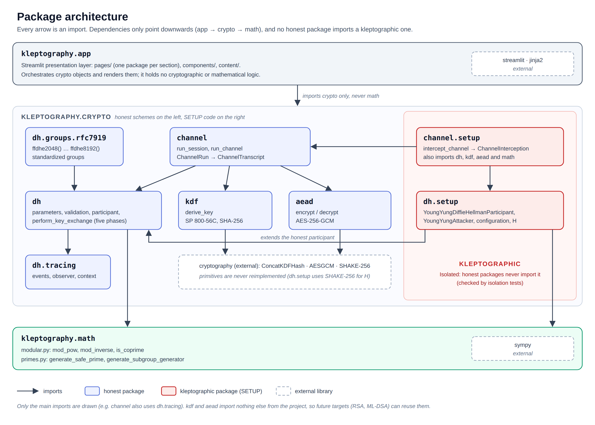

# Architecture

This page explains how the code is organized, which package may import
which, and the conventions every package follows. Read it before diving
into the API pages: they all rely on the rules below.



## Three layers

The package `kleptography` has three layers, and dependencies only point
downwards:

| Layer | Package | Role | External dependencies |
| --- | --- | --- | --- |
| Presentation | `kleptography.app` | Streamlit interface: renders the objects produced by `crypto`. | `streamlit`, `jinja2` |
| Schemes | `kleptography.crypto` | The cryptographic schemes, honest and kleptographic. | `cryptography` (the SETUP's hash, KDF and AEAD) |
| Number theory | `kleptography.math` | Modular arithmetic and prime generation. | `sympy` (primes only) |

- `math` imports nothing from the project. It works on plain integers.
- `crypto` never imports `streamlit` or `app`, so it can be used as a
  library, in a notebook or in tests (see the
  [README](../README.md#using-the-library)).
- `app` contains no cryptographic or mathematical logic: it builds
  `crypto` objects, runs them and reads the values they expose. It never
  imports `math` directly.

## Inside `crypto`

| Package | Contents | Imports from the project | Page |
| --- | --- | --- | --- |
| `crypto.dh` | Honest finite-field Diffie-Hellman: parameters, validation, participant, protocol | `dh.tracing`, `math` | [dh.md](dh.md) |
| `crypto.dh.tracing` | Events emitted by the protocol, observer, execution context | nothing | [dh.md](dh.md#tracing) |
| `crypto.dh.groups.rfc7919` | Standardized groups `ffdhe2048()` … `ffdhe8192()` | `dh` | [dh.md](dh.md#standardized-groups-rfc-7919) |
| `crypto.dh.setup` | **Kleptographic.** Young–Yung SETUP: device, attacker, configuration, hash `H` | `dh`, `math` | [setup.md](setup.md) |
| `crypto.kdf` | One-step KDF (NIST SP 800-56C), SHA-256 | nothing | [primitives.md](primitives.md#key-derivation-kdf) |
| `crypto.aead` | AES-256-GCM authenticated encryption | nothing | [primitives.md](primitives.md#authenticated-encryption-aead) |
| `crypto.channel` | Encrypted channel: ephemeral DH, KDF and AEAD per session | `dh`, `dh.tracing`, `kdf`, `aead` | [channel.md](channel.md) |
| `crypto.channel.setup` | **Kleptographic.** The attacker that reads a channel from its transcript | `channel`, `dh`, `dh.setup`, `dh.tracing`, `kdf`, `aead`, `math` | [channel.md](channel.md#the-attacker-channelsetup) |

Two packages deserve a note:

- **`kdf` and `aead` import nothing else from the project.** They take
  integers and bytes, not Diffie-Hellman objects, so a future target (RSA,
  ML-DSA) can reuse them unchanged.
- **`channel` is one ordinary protocol, not an "honest channel".** It
  accepts any `DiffieHellmanParticipant`. Passing the compromised device as
  Alice is enough to compromise it: there is no SETUP copy of the channel
  and no flag.

## Honest and kleptographic code stay apart

The project's central rule is that the legitimate scheme and its
kleptographic version are always explicit and comparable:

- **Separate packages.** Every SETUP lives in a `setup/` subpackage next to
  the scheme it attacks (`dh/setup/`, `channel/setup/`).
- **Separate classes, never flags.** The compromised device,
  `YoungYungDiffieHellmanParticipant`, is a subclass of
  `DiffieHellmanParticipant` that overrides how private keys are
  generated. The honest class has no "malicious mode".
- **Drop-in replacement.** The device is accepted wherever an honest
  participant is (`perform_key_exchange`, `run_channel`), and its outputs
  pass exactly the same validation. That is what makes it hard to detect.
- **One-way dependency.** Kleptographic packages import honest ones, never
  the reverse. Isolation tests enforce it:

| Test | Checks |
| --- | --- |
| `tests/crypto/dh/setup/test_setup_isolation.py` | No honest DH module imports the SETUP; the honest participant has no SETUP field. |
| `tests/crypto/channel/test_channel_isolation.py` | Channel modules import only `channel`, `dh`, `kdf` and `aead`, and never kleptographic code. |
| `tests/crypto/channel/setup/test_channel_setup_isolation.py` | The attacker imports only `channel`, `dh`, `kdf`, `aead` and `math`, and has no UI or primitive of its own. |
| `tests/crypto/kdf/test_kdf_isolation.py` | KDF modules import only the KDF package. |
| `tests/crypto/aead/test_aead_isolation.py` | AEAD modules import only the AEAD package. |

## Conventions shared by every package

### Value objects

Results are frozen, slotted dataclasses
(`@dataclass(frozen=True, slots=True)`) validated in `__post_init__`. An
object that exists is therefore always consistent: a
`DiffieHellmanParameters` is always a valid safe-prime group, a
`KeyDerivation` always holds the key derived from its secret.

Value objects are also how the project teaches. Each step exposes its
intermediate values (`SetupDerivation`, `SetupRecovery`, `KeyDerivation`,
`EncryptedMessage`, `ChannelRun`, …), so the interface, a notebook or a
test can show every number without recomputing anything. Secret values are
hidden from `repr`.

### Exceptions

Each scheme has its own hierarchy, and every error also subclasses the
matching built-in, so callers can catch either:

| Base | Package | Errors |
| --- | --- | --- |
| `DiffieHellmanError` | `dh` | `InvalidDiffieHellmanParameters`, `InvalidPrivateKey`, `InvalidPublicKey`, `DiffieHellmanParametersMismatch` (all `ValueError`), `DiffieHellmanStateError` (`RuntimeError`) |
| `SetupError(DiffieHellmanError)` | `dh.setup` | `InvalidSetupConfiguration`, `SetupRecoveryError` (both `ValueError`) |
| `KdfError` | `kdf` | `InvalidKdfInput`, `InvalidKeyDerivation` (both `ValueError`) |
| `AeadError` | `aead` | `InvalidAeadKey`, `InvalidAeadNonce`, `InvalidAeadTag`, `AeadAuthenticationError` (all `ValueError`) |
| `ChannelError` | `channel` | `InvalidChannelMessage`, `InvalidChannelSessions` (both `ValueError`); `InvalidChannelInterception` in `channel.setup` |

DH errors raised inside the channel propagate unwrapped.

### Other rules

- **Keyword-only integers.** Functions that take several integers of the
  same kind (`prime`, `generator`, `subgroup_order`, …) make them
  keyword-only, so `p`, `g` and `q` cannot be swapped by position.
- **Randomness.** Secrets come from the `secrets` module, never `random`.
  Primality is tested with `sympy`.
- **No reimplemented primitives.** SHAKE-256 (the SETUP's hash `H`), the
  SHA-256 KDF and AES-GCM all come from `cryptography`. The project only
  implements the schemes and the SETUP around them.
- **Fixed-width encodings.** Values modulo `p` are encoded big-endian with
  the byte length of `p` (as I2OSP), both in the SETUP hash `H` and in the
  KDF input.

## Toy and standardized parameters

The project never confuses the two:

- **Toy groups** (`DiffieHellmanParameters.generate_toy(bits)`) are
  generated at random, with 8 to 64 bits in the interface. They are
  **insecure** and exist only so that every number fits on screen.
- **Standardized groups** (`ffdhe2048()` … `ffdhe8192()`) are fixed
  constants copied from RFC 7919 and validated on every call.

Even with a standardized group, this is educational code: it omits
production protections (constant-time arithmetic, side-channel resistance,
key management) and must not be used to protect real data.

## Didactic model: tracing and value objects

Two mechanisms expose what happens inside a run:

1. **Tracing** (`crypto.dh.tracing`). `perform_key_exchange` reports each
   semantic step to an optional observer, which records a timeline of
   events. A compromised device emits exactly the same timeline as an
   honest one.
2. **Value objects.** Everything that happens outside an exchange (the
   SETUP derivation between exchanges, the attacker's recovery, the KDF,
   the encryption of messages) is returned as frozen records instead of
   new events.

## Testing

Tests mirror the source tree (`src/kleptography/x/y.py` →
`tests/x/test_y.py`) and use a fixed toy group (`p = 23`, `g = 2`,
`q = 11`) with loaded keys, so every value can be checked by hand. `crypto`
and `math` are at 100% coverage. For kleptographic code, tests check at
least that honest parties still agree, that the attacker recovers the
intended value, and that the outputs pass the same validation as honest
ones.

```bash
uv run pytest                                         # whole suite
uv run coverage run -m pytest && uv run coverage report
```
