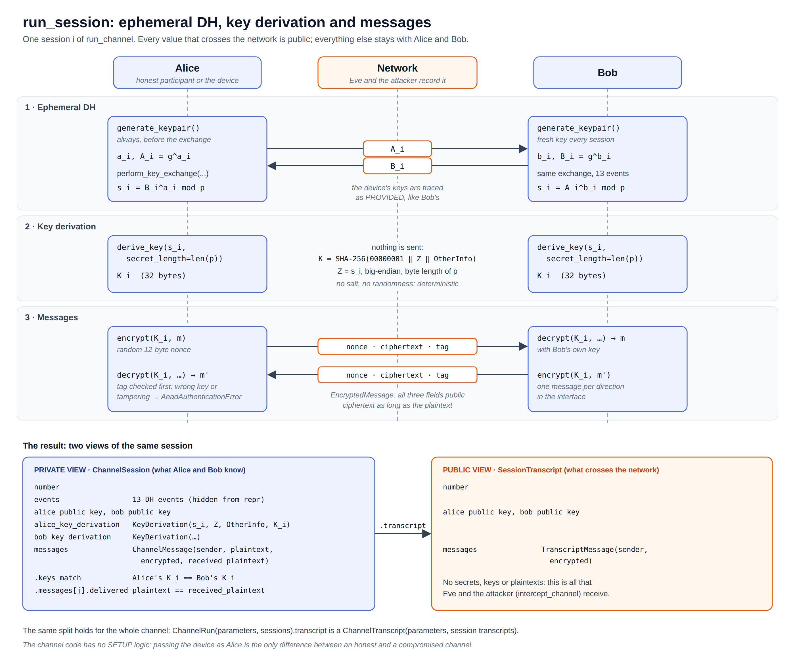

# Encrypted channel (`kleptography.crypto.channel`)

The channel extends the case study from a single key exchange to a complete
cryptosystem: several sessions, each with an ephemeral Diffie-Hellman
exchange, a key derivation and authenticated messages. It shows that a
compromised key establishment affects the whole channel without breaking
any cipher.

| Module | Contents |
| --- | --- |
| `records.py` | Input messages, the private view and the public view (below) |
| `session.py` | `run_session`: one session |
| `protocol.py` | `run_channel`: several sessions in a row |
| `exceptions.py` | `ChannelError` and its subclasses |
| `setup/` | **Kleptographic.** The attacker's view of a transcript ([below](#the-attacker-channelsetup)) |

## One channel, no SETUP variant

`crypto/channel/` is an ordinary protocol: it contains no kleptographic
logic and works with any `DiffieHellmanParticipant`. The case study runs it
with the Young–Yung device ([setup.md](setup.md)) as Alice:

```py
run_channel(device, DiffieHellmanParticipant(parameters), sessions)
```

Before every session the channel calls `generate_keypair()` on both
participants, and the device's override of that method is what chains its
exponents. There is no SETUP copy of the channel and no flag; the isolation
test checks that `channel` never imports `dh.setup` or `channel.setup`.

## A session



### `run_session(alice, bob, messages, *, number) -> ChannelSession`

1. Checks that both participants use the same group
   (`DiffieHellmanParametersMismatch`, before any key is generated).
2. **Always** calls `generate_keypair()` on Alice, then Bob, replacing any
   previous key: ephemeral DH. Chosen keys are therefore not supported, and
   the exchange's timeline traces both keys as `PRIVATE_KEY_PROVIDED`.
3. Runs `perform_key_exchange` with its own `ProtocolExecutionContext`
   ([dh.md](dh.md#the-protocol)).
4. Each party derives its own key from its own secret:
   `derive_key(s, secret_length=parameters.byte_length)`
   ([primitives.md](primitives.md#key-derivation-kdf)).
5. Each message is encrypted under the sender's key with a fresh random
   nonce and decrypted under the recipient's key
   ([primitives.md](primitives.md#authenticated-encryption-aead)).

Because each side uses its own key, a successful session shows that both
really derived the same one.

### `run_channel(alice, bob, sessions) -> ChannelRun`

Runs one session per entry of `sessions` (a sequence of `PlainMessage`s,
possibly empty), numbered from 1. It raises `InvalidChannelSessions` if
`sessions` is empty, and checks the groups before running any session.

With honest participants, every session has fresh keys, so the session keys
are independent: learning one reveals nothing about the others. A
compromised device as Alice breaks exactly this property, while the channel
and its transcript stay unchanged.

## Records: input, private view, public view

### Input

`PlainMessage(sender, text)`: `sender` is `Actor.ALICE` or `Actor.BOB`
(from `dh.tracing`); the recipient is the other one (`.recipient`). `text`
is printable ASCII (`isascii()` and `isprintable()`, so no newlines or
tabs), from 1 to `MAX_MESSAGE_LENGTH = 140` characters. Anything else raises
`InvalidChannelMessage`.

### Private view (what Alice and Bob know)

| Record | Fields | Properties |
| --- | --- | --- |
| `ChannelMessage` | `sender`, `plaintext`, `encrypted`, `received_plaintext` | `.recipient`, `.delivered` (the recipient read exactly what was sent), `.transcript` |
| `ChannelSession` | `number`, `events` (hidden from `repr`), `alice_public_key`, `bob_public_key`, `alice_key_derivation`, `bob_key_derivation`, `messages` | `.keys_match`, `.transcript` |
| `ChannelRun` | `parameters`, `sessions` | `.transcript` |

### Public view (what crosses the network)

| Record | Fields |
| --- | --- |
| `TranscriptMessage` | `sender`, `encrypted` (an `EncryptedMessage`) |
| `SessionTranscript` | `number`, `alice_public_key`, `bob_public_key`, `messages` |
| `ChannelTranscript` | `parameters`, `sessions` |

Each private record builds its public counterpart through `.transcript`.
The public view holds no secret, key or plaintext: it is all that an
eavesdropper records, and the only input the attacker's API accepts.

Session numbers start at 1. Runs and transcripts need at least one session,
numbered 1, 2, … in order (`InvalidChannelSessions`).

## Example

```python
from kleptography.crypto.channel.protocol import run_channel
from kleptography.crypto.channel.records import PlainMessage
from kleptography.crypto.dh.parameters import DiffieHellmanParameters
from kleptography.crypto.dh.participant import DiffieHellmanParticipant
from kleptography.crypto.dh.tracing.events import Actor

parameters = DiffieHellmanParameters.generate_toy(32)  # insecure, for reading
sessions = [
    [
        PlainMessage(sender=Actor.ALICE, text=f"Hello from session {number}"),
        PlainMessage(sender=Actor.BOB, text="Received"),
    ]
    for number in (1, 2, 3)
]

run = run_channel(
    DiffieHellmanParticipant(parameters),
    DiffieHellmanParticipant(parameters),
    sessions,
)
assert all(session.keys_match for session in run.sessions)
assert all(
    message.delivered for session in run.sessions for message in session.messages
)

transcript = run.transcript  # the public view
first = transcript.sessions[0]
assert first.number == 1
assert first.messages[0].sender is Actor.ALICE  # sender and ciphertext only
```

Passing the device of [setup.md](setup.md) as the first argument instead of
an honest participant changes nothing in this code or in the transcript's
format.

## The attacker (`channel.setup`)

The package `crypto/channel/setup/` holds the only kleptographic code of
the channel. It follows the rules of `dh/setup/`: separate package, the
paper's names, and an isolation test (it imports only `channel`, `dh`,
`kdf`, `aead` and `math`, and has no symmetric code of its own).

Its entry point, `intercept_channel(transcript, *, attacker, configuration)`,
takes **only the public `ChannelTranscript`**, plus the attacker and the
configuration of [setup.md](setup.md). It applies the recovery described
there to each consecutive pair of Alice's public keys and reports, for each
session, an `InterceptionOutcome`:

| Outcome | Meaning |
| --- | --- |
| `NOT_RECOVERABLE` | Session 1: there is no previous public key, so it stays confidential (the (1, 2)-leakage). |
| `RECOVERY_FAILED` | No candidate matched, for example because Alice used an honest participant. Reported, never raised. |
| `RECOVERED` | The session was read. |

The results are frozen records (`ChannelInterception`, `InterceptedSession`,
`InterceptedMessage`) that keep every intermediate value and validate their
own consistency. For the details, read the source and its docstrings
(`src/kleptography/crypto/channel/setup/`) and the tests
(`tests/crypto/channel/setup/`); the interactive section
`/encrypted-channel` walks through the same steps in its Attacker tab.

## Errors

| Exception | Also a | Raised when |
| --- | --- | --- |
| `InvalidChannelMessage` | `ValueError` | Invalid sender or text. |
| `InvalidChannelSessions` | `ValueError` | No sessions, or sessions not numbered 1, 2, … |
| `InvalidChannelInterception` | `ValueError` | An inconsistent interception record (`channel.setup`). |

All subclass `ChannelError`, independent of the DH, KDF and AEAD
hierarchies. DH errors raised inside a session propagate unwrapped.

## Limitations

This is educational code, not a hardened protocol:

- The public keys are not authenticated, so an active attacker in the
  middle is out of scope. The project studies a different threat: a
  compromised device.
- No replay protection, no key confirmation step, no associated data
  binding a message to its session.
- With a toy group, every session key is brute-forceable by anyone.
