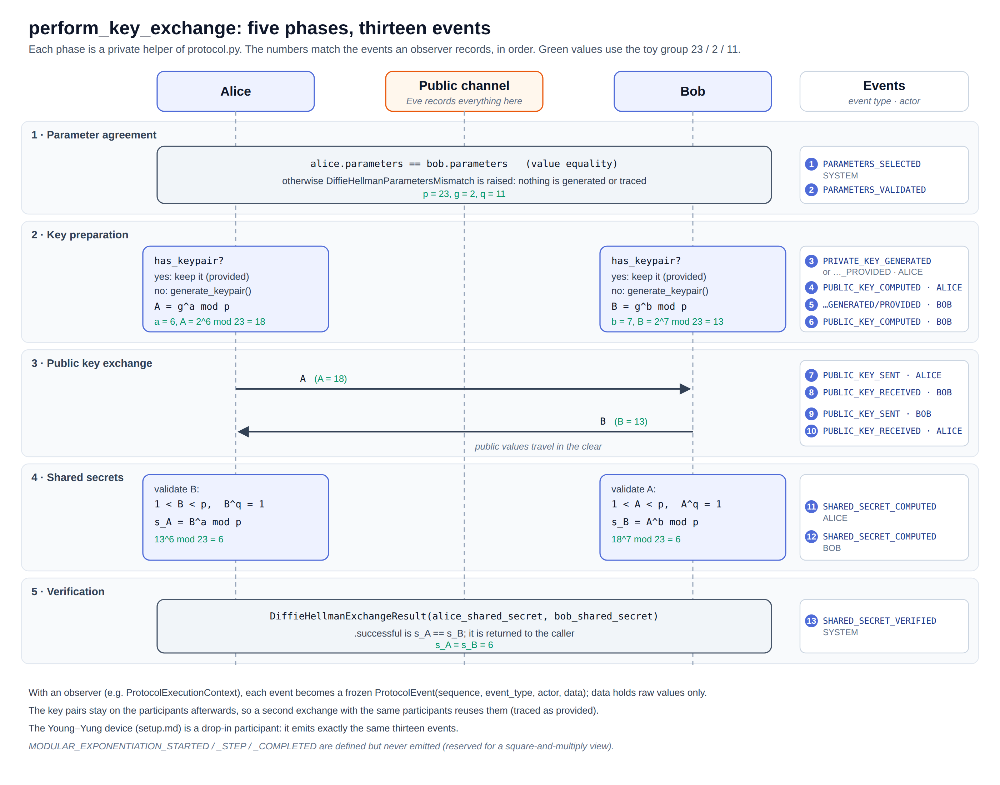

# Diffie-Hellman (`kleptography.crypto.dh`)

This package implements the **honest** finite-field Diffie-Hellman key
exchange: the reference construction that the Young–Yung SETUP
([setup.md](setup.md)) later compromises. Nothing in it knows about the
SETUP.

| Module | Contents |
| --- | --- |
| `parameters.py` | `DiffieHellmanParameters`: the public group `(p, g, q)` |
| `validation.py` | `validate_parameters`, `validate_private_key`, `validate_public_key` |
| `participant.py` | `DiffieHellmanParticipant`: a key pair and the shared secret |
| `protocol.py` | `perform_key_exchange`: the five phases of an exchange |
| `exchange.py` | `DiffieHellmanExchangeResult`: both secrets and whether they match |
| `exceptions.py` | `DiffieHellmanError` and its subclasses |
| `tracing/` | Events, observer and execution context ([Tracing](#tracing)) |
| `groups/rfc7919/` | `ffdhe2048()` … `ffdhe8192()` ([Standardized groups](#standardized-groups-rfc-7919)) |

## The scheme in one paragraph

Alice and Bob agree on public parameters: a safe prime `p = 2q + 1` and a
generator `g` of the subgroup of prime order `q`. Each one picks a secret
exponent in `[1, q - 1]` (Alice `a`, Bob `b`) and publishes `g` raised to
it (`A = g^a mod p`, `B = g^b mod p`). Each one then raises the other's
public value to its own secret: `B^a = A^b = g^(ab) mod p`, the shared
secret. An eavesdropper sees `p`, `g`, `A` and `B`; computing `g^(ab)` from
them is the computational Diffie-Hellman problem, believed hard for large
groups.

## Quick example

```python
from kleptography.crypto.dh.parameters import DiffieHellmanParameters
from kleptography.crypto.dh.participant import DiffieHellmanParticipant
from kleptography.crypto.dh.protocol import perform_key_exchange
from kleptography.crypto.dh.tracing.context import ProtocolExecutionContext

parameters = DiffieHellmanParameters(prime=23, generator=2, subgroup_order=11)
alice = DiffieHellmanParticipant(parameters)
bob = DiffieHellmanParticipant(parameters)
alice.load_private_key(6)  # known keys, so the run is reproducible
bob.load_private_key(7)

context = ProtocolExecutionContext()
result = perform_key_exchange(alice, bob, observer=context)

assert (alice.public_key, bob.public_key) == (18, 13)
assert result.alice_shared_secret == result.bob_shared_secret == 6
assert result.successful
assert len(context.events) == 13
```

Without `load_private_key`, each participant generates a random key during
the exchange.

## Parameters

### `DiffieHellmanParameters(prime, generator, subgroup_order)`

A frozen, slotted and hashable dataclass. Its constructor calls
`validate_parameters`, so **every instance is a valid group**:

| Check | Why |
| --- | --- |
| `p > 2`, `q > 1` | Degenerate groups are rejected. |
| `1 < g < p` | `g` is a non-trivial element modulo `p`. |
| `p == 2q + 1` | Only safe-prime groups are supported. |
| `g^q ≡ 1 (mod p)` | `g` lies in the subgroup of order `q`. |

A failed check raises `InvalidDiffieHellmanParameters`. The validation does
**not** test that `p` and `q` are prime: toy groups are prime by
construction, and standardized groups are trusted constants whose primality
the tests check once.

| Member | Description |
| --- | --- |
| `.bit_length` | Bit length of `p`. |
| `.byte_length` | `ceil(bit_length / 8)`: the fixed width used to encode any value modulo `p` (the SETUP's hash and the KDF use it). |
| `generate_toy(bits=32)` | Random **insecure** group for demonstrations and tests: `generate_safe_prime(bits)` and `generate_subgroup_generator(p)` from [math](math.md). |
| `from_standard(*, prime, generator, subgroup_order)` | Entry point for standardized groups. It does not check where the values come from; the caller is responsible for that. |

Two instances are equal when their values are equal, which is how the
protocol checks that both participants use the same group.

### Validation functions

`validation.py` works on raw integers and does not import
`parameters.py`, which avoids a circular import. All three are keyword-only
after the first argument:

| Function | Accepts | Raises |
| --- | --- | --- |
| `validate_parameters(*, prime, generator, subgroup_order)` | the checks above | `InvalidDiffieHellmanParameters` |
| `validate_private_key(x, *, subgroup_order)` | `1 <= x < q` | `InvalidPrivateKey` |
| `validate_public_key(y, *, prime, subgroup_order)` | `1 < y < p` and `y^q ≡ 1 (mod p)` | `InvalidPublicKey` |

The public key check is a **subgroup membership test**. It rejects values
such as `1`, `p - 1` or elements outside the subgroup, which an active
attacker could send to force a predictable shared secret (small-subgroup
attacks). The SETUP is dangerous precisely because its public values pass
this check.

## Participants

### `DiffieHellmanParticipant(parameters)`

A slotted dataclass that holds one key pair. The key pair is read-only from
the outside and changes only through two methods, which both derive the
public value from the exponent, so `public_key == g^x mod p` always holds.

| Member | Description |
| --- | --- |
| `.private_key` | The exponent `x`, or `None` before a key pair exists. Hidden from `repr`. |
| `.public_key` | `g^x mod p`, or `None`. |
| `.has_keypair` | Whether a key pair exists. |
| `generate_keypair()` | New random `x = secrets.randbelow(q - 1) + 1`, replacing any previous pair. |
| `load_private_key(x)` | Use a known exponent (reproducible demos, tests). Raises `InvalidPrivateKey` unless `1 <= x < q`. |
| `compute_shared_secret(peer_public_key)` | Validates the peer's value and returns `peer^x mod p`. Raises `DiffieHellmanStateError` if the peer key or the own key pair is missing, `InvalidPublicKey` if the peer key is invalid. |

Two private helpers are the points where a variant can differ:
`_generate_private_key()` (how `x` is chosen) and `_compute_public_key(x)`.
The SETUP device overrides only the first one; see
[setup.md](setup.md#the-device).

## The protocol



### `perform_key_exchange(alice, bob, *, observer=None) -> DiffieHellmanExchangeResult`

Runs one exchange in five explicit phases, each a private helper of
`protocol.py`:

| Phase | Helper | What happens |
| --- | --- | --- |
| 1. Parameter agreement | `_agree_parameters` | Raises `DiffieHellmanParametersMismatch` if `alice.parameters != bob.parameters`. On failure nothing is generated or traced. |
| 2. Key preparation | `_prepare_keypair` (Alice, then Bob) | A participant that already `has_keypair` keeps it (**provided** key); otherwise `generate_keypair()` is called (**generated** key). |
| 3. Public key exchange | `_send_public_key` (Alice → Bob, then Bob → Alice) | The public values cross the public channel. |
| 4. Shared secrets | `_compute_shared_secret` (Alice, then Bob) | Each participant validates the peer's public value and computes its secret. |
| 5. Verification | in `perform_key_exchange` | Builds the result and emits the last event. |

The key pairs stay on the participants after the exchange. Running a
second exchange with the same participants therefore reuses the same keys
(static DH). For fresh ephemeral keys, use new participants or call
`generate_keypair()` before the exchange; the key is then traced as
provided.

### `DiffieHellmanExchangeResult(alice_shared_secret, bob_shared_secret)`

Frozen. `.successful` returns whether both secrets are equal. With honest
participants and valid keys it is always `True`; it exists so the
verification is an explicit step of the protocol.

## Tracing

`crypto.dh.tracing` lets a caller watch an exchange without changing it.
The protocol depends on tracing; tracing never imports DH classes.

| Name | Description |
| --- | --- |
| `Actor` (`StrEnum`) | `SYSTEM`, `ALICE`, `BOB`. There is no attacker actor: SETUP internals are exposed as value objects instead. |
| `ProtocolEventType` (`StrEnum`) | The semantic steps (below). |
| `ProtocolEvent(sequence, event_type, actor, data)` | Frozen. `sequence >= 1`; `data` is copied into a read-only mapping. |
| `OperationObserver` | Abstract base class with one method, `observe(event_type, *, actor, data=None)`. |
| `ProtocolExecutionContext` | An observer that records events with sequence numbers from 1. `.events` returns an immutable tuple. |

An exchange with an observer emits **13 events**:

| # | Event | Actor | `data` |
| --- | --- | --- | --- |
| 1 | `PARAMETERS_SELECTED` | SYSTEM | `prime`, `generator`, `subgroup_order` |
| 2 | `PARAMETERS_VALIDATED` | SYSTEM | same (both participants use the group) |
| 3 | `PRIVATE_KEY_GENERATED` or `PRIVATE_KEY_PROVIDED` | ALICE | `private_key`, `subgroup_order` |
| 4 | `PUBLIC_KEY_COMPUTED` | ALICE | `base`, `exponent`, `modulus`, `public_key`, `expression` (e.g. `"2^6 mod 23"`) |
| 5–6 | same as 3–4 | BOB | |
| 7 | `PUBLIC_KEY_SENT` | ALICE | `recipient`, `public_key` |
| 8 | `PUBLIC_KEY_RECEIVED` | BOB | `sender`, `public_key` |
| 9–10 | same as 7–8, from Bob to Alice | BOB, ALICE | |
| 11 | `SHARED_SECRET_COMPUTED` | ALICE | `peer_public_key`, `private_key`, `modulus`, `shared_secret`, `expression` |
| 12 | `SHARED_SECRET_COMPUTED` | BOB | same |
| 13 | `SHARED_SECRET_VERIFIED` | SYSTEM | `alice_shared_secret`, `bob_shared_secret`, `successful` |

Notes:

- Events deliberately include private values: showing them is the
  educational goal. They hold raw values only, never formatting, so any
  interface can render them.
- `PRIVATE_KEY_PROVIDED` versus `PRIVATE_KEY_GENERATED` records whether the
  exponent existed before the exchange or was sampled during it.
- `MODULAR_EXPONENTIATION_STARTED`, `_STEP` and `_COMPLETED` are defined but
  never emitted yet. They are reserved for a step-by-step view of square
  and multiply.
- A SETUP device emits the same sequence of events (same types and actors,
  in the same order) as an honest participant; only the values differ, and
  they look random in both cases. The tests check it
  (`test_device_timeline_looks_like_honest_timeline`): the backdoor leaves
  no trace in the protocol.

```python
for event in context.events[:4]:
    print(event.sequence, event.event_type, event.actor, dict(event.data))
# 1 parameters_selected system {'prime': 23, 'generator': 2, 'subgroup_order': 11}
# 2 parameters_validated system {'prime': 23, 'generator': 2, 'subgroup_order': 11}
# 3 private_key_provided alice {'private_key': 6, 'subgroup_order': 11}
# 4 public_key_computed alice {'base': 2, 'exponent': 6, 'modulus': 23, 'public_key': 18, 'expression': '2^6 mod 23'}
```

## Standardized groups (RFC 7919)

`crypto.dh.groups.rfc7919` provides the five finite-field groups of
RFC 7919 ("Negotiated Finite Field Diffie-Hellman Ephemeral Parameters for
TLS"):

| Function | Bits of `p` | `g` |
| --- | --- | --- |
| `ffdhe2048()` | 2048 | 2 |
| `ffdhe3072()` | 3072 | 2 |
| `ffdhe4096()` | 4096 | 2 |
| `ffdhe6144()` | 6144 | 2 |
| `ffdhe8192()` | 8192 | 2 |

- Each one is a **function**, not a constant: it returns
  `DiffieHellmanParameters.from_standard(...)` built from the hexadecimal
  constants copied from the RFC, so every call re-runs validation.
- They are safe-prime groups (`p = 2q + 1`), so they satisfy the same
  invariants as toy groups.
- `ffdhe8192()` is slow to validate and to use (one exponentiation takes
  about a second in pure Python); avoid it in hot paths.
- The tests check primality of `p` and `q`, `g^q ≡ 1`, the bit length and
  the exact RFC constants.

```python
from kleptography.crypto.dh.groups.rfc7919 import ffdhe2048

group = ffdhe2048()
assert (group.bit_length, group.byte_length, group.generator) == (2048, 256, 2)
```

## Errors

| Exception | Also a | Raised when |
| --- | --- | --- |
| `InvalidDiffieHellmanParameters` | `ValueError` | A group fails validation. |
| `InvalidPrivateKey` | `ValueError` | A loaded exponent is outside `[1, q - 1]`. |
| `InvalidPublicKey` | `ValueError` | A peer's value is outside `(1, p)` or not in the subgroup. |
| `DiffieHellmanParametersMismatch` | `ValueError` | The two participants use different groups. |
| `DiffieHellmanStateError` | `RuntimeError` | A secret is computed before a key pair exists or without a peer key. |

All of them subclass `DiffieHellmanError`.

## Limitations

- Toy groups are insecure by design: a 16-bit discrete logarithm is solved
  instantly by brute force.
- No constant-time arithmetic, no key erasure, no protection against side
  channels.
- The exchange authenticates nobody. It protects against an eavesdropper
  (Eve), not against an active attacker in the middle. Authentication is out
  of scope: the project studies a different threat, a compromised device.
