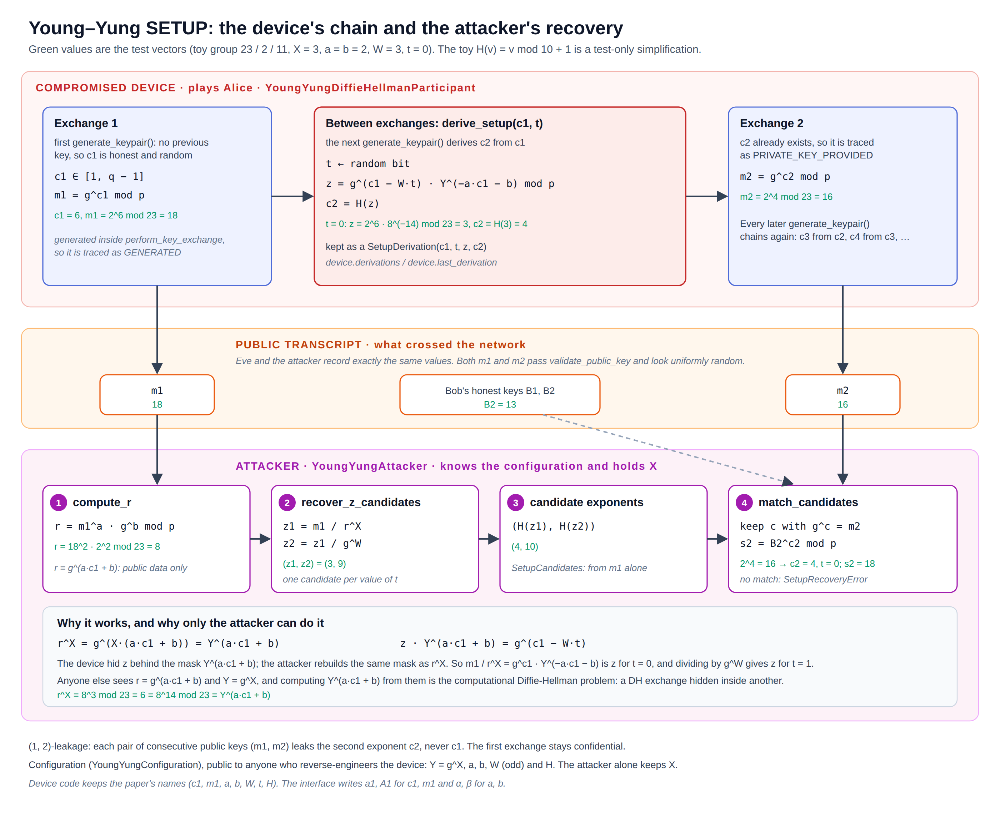

# Young–Yung SETUP (`kleptography.crypto.dh.setup`)

This package is **kleptographic**: it implements the backdoored
Diffie-Hellman device of Young and Yung and the attacker who exploits it.
It depends on the honest package ([dh.md](dh.md)), which never imports it.

> **Source.** A. L. Young and M. Yung, "Kleptography: Using Cryptography
> Against Cryptography", EUROCRYPT '97, LNCS 1233, pp. 62–74, Springer,
> 1997. The code and its docstrings keep the paper's names (`c1`, `m1`,
> `a`, `b`, `W`, `t`, `H`). Choices the paper leaves open are listed in
> [Implementation choices](#implementation-choices).
>
> This code exists for education and analysis. It is not an attack tool:
> it only works against a device built with it.

| Module | Contents |
| --- | --- |
| `configuration.py` | `YoungYungConfiguration`: the constants embedded in the device |
| `hashing.py` | `hash_to_exponent` (the paper's `H`) and the `SetupHashFunction` protocol |
| `construction.py` | The SETUP equations as pure functions |
| `participant.py` | `YoungYungDiffieHellmanParticipant`: the compromised device |
| `attacker.py` | `YoungYungAttacker`: the holder of the trapdoor `X` |
| `records.py` | `SetupDerivation`, `SetupCandidates`, `SetupRecovery` |
| `exceptions.py` | `SetupError` and its subclasses |

## What a SETUP is

A SETUP (Secretly Embedded Trapdoor with Universal Protection) is a
black-box device whose outputs look like those of an honest
implementation, but leak secret information to an attacker:

- **Indistinguishable outputs.** Without the attacker's private key, the
  device's outputs cannot be told apart from honest ones.
- **Asymmetric trapdoor.** The device contains only the attacker's
  **public** key `Y = g^X`. Reverse-engineering the device reveals how the
  leak works, but not how to read it: that needs `X`.
- **Leak only to the attacker.** The leaked information is recoverable only
  with `X`, not by an eavesdropper (Eve) or by whoever opens the device.

The roles in this case study:

| Role | Knows | Can |
| --- | --- | --- |
| Alice | her device's outputs | run Diffie-Hellman normally; she cannot inspect the device |
| Bob | his honest key pair | run Diffie-Hellman normally |
| Eve | the public transcript | nothing beyond the Diffie-Hellman problem |
| Reverse engineer | the configuration: `Y`, `a`, `b`, `W`, `H` | understand the mechanism, not exploit it |
| Attacker | the configuration **and `X`** | recover the device's exponents from consecutive public keys |

## The construction



The group is a safe-prime group with a subgroup of prime order `q`; every
exponent is reduced modulo `q` and every division modulo `p` uses the
modular inverse.

**Device.** The first exponent `c1` is honest and random; the device sends
`m1 = g^c1`. For the next exchange it draws a random bit `t` and computes

```text
z  = g^(c1 − W·t) · Y^(−a·c1 − b)  mod p
c2 = H(z)
```

and sends `m2 = g^c2`. Each later exchange chains the same way (`c3` from
`c2`, …).

**Attacker.** From `m1` alone it computes

```text
r  = m1^a · g^b   mod p        (= g^(a·c1 + b))
z1 = m1 / r^X     mod p        (z if t = 0)
z2 = z1 / g^W     mod p        (z if t = 1)
```

and keeps the candidate `c2 ∈ {H(z1), H(z2)}` that satisfies `g^c2 = m2`.
With `c2` and Bob's second public key `B2`, the second shared secret is
`B2^c2 mod p`.

**Why the recovery works.** Since `Y = g^X`,

```text
r^X = g^(X·(a·c1 + b)) = Y^(a·c1 + b)
m1 / r^X = g^c1 · Y^(−a·c1 − b) = z · g^(W·t)
```

so `z1 = z` when `t = 0`, and `z2 = z1 / g^W = z` when `t = 1`. The device
masked `z` with `Y^(a·c1 + b)`; the attacker rebuilds the same mask from
public values and `X`.

**Why nobody else can.** Eve and the reverse engineer see `r = g^(a·c1 + b)`
and `Y = g^X`. Computing `Y^(a·c1 + b) = g^(X·(a·c1 + b))` from them is the
computational Diffie-Hellman problem: the SETUP hides a second DH exchange,
between the device and the attacker, inside the visible one.

**How much leaks: a (1, 2)-leakage scheme.** Each pair of consecutive public
keys `(m_{i-1}, m_i)` leaks `c_i`, never `c_{i-1}`. The first exponent `c1`
is honest, so the first exchange stays confidential even for the attacker.
Over `N` exchanges, the attacker reads exchanges `2…N`.

## Configuration

### `YoungYungConfiguration(*, parameters, attacker_public_key, multiplier_a, offset_b, correction_w, hash_function=hash_to_exponent)`

A frozen, slotted, keyword-only dataclass with everything the attacker
embeds in the device. All of it is public to a reverse engineer.

| Field | Paper | Validation |
| --- | --- | --- |
| `parameters` | the group | — |
| `attacker_public_key` | `Y = g^X` | a valid public value of the group (`InvalidPublicKey`) |
| `multiplier_a` | `a` | nonzero modulo `q` |
| `offset_b` | `b` | — |
| `correction_w` | `W` | odd, and nonzero modulo `q` |
| `hash_function` | `H` | any `SetupHashFunction` |

A failed check on `a` or `W` raises `InvalidSetupConfiguration`.

In a subgroup of prime order, "`W` odd" has no mathematical effect; it is
kept for fidelity to the paper.

### `hash_to_exponent(z, *, parameters) -> int`

The default `H`. It computes SHAKE-256 (from `cryptography`) over the domain
tag `b"young-yung-setup-H"` followed by `z` encoded big-endian with the byte
length of `p` (fixed width, as I2OSP), with 8 more output bytes than `q`
needs, and reduces the digest as `digest mod (q − 1) + 1`. The result lies
in `[1, q − 1]` with a bias below `2^-64` (the "extra random bits" method of
FIPS 186-5, Appendix A.2.1).

- Raises `ValueError` unless `1 <= z < p`.
- Any callable with the signature `(value, *, parameters) -> int` can replace
  it (the `SetupHashFunction` protocol). The tests use a toy
  `H(v) = v mod 10 + 1` so that every value can be checked by hand; it is a
  test-only simplification.

## Equations (`construction.py`)

Pure functions, called by the device and the attacker:

| Function | Computes | Raises |
| --- | --- | --- |
| `compute_z(c1, *, correction_bit, configuration)` | `z = g^(c1 − W·t) · Y^(−a·c1 − b) mod p` | `InvalidPrivateKey` (bad `c1`), `ValueError` (`t` not 0 or 1) |
| `derive_setup(c1, *, correction_bit, configuration)` | `SetupDerivation(c1, t, z, c2 = H(z))` | same, and `InvalidPrivateKey` if `H` leaves `[1, q − 1]` |
| `derive_private_key(c1, *, correction_bit, configuration)` | only `c2` | same |
| `compute_r(m1, *, configuration)` | `r = m1^a · g^b mod p` | `InvalidPublicKey` (bad `m1`) |
| `recover_z_candidates(m1, *, attacker_private_key, configuration)` | `(z1, z2) = (m1 / r^X, z1 / g^W)` | `InvalidPublicKey`, `InvalidPrivateKey` (bad `X`) |

## The device

### `YoungYungDiffieHellmanParticipant(parameters, configuration)`

A subclass of `DiffieHellmanParticipant`, so it is a drop-in argument to
`perform_key_exchange` and to the channel's `run_channel`. It raises
`DiffieHellmanParametersMismatch` if its group differs from the
configuration's.

It overrides only `_generate_private_key()`:

- **No key yet** (a new device, or after `load_private_key`): an honest,
  random `c1`. This starts a new chain.
- **A key exists**: `derive_setup(previous, t, configuration)` with a fresh
  random bit `t`. This continues the chain.

| Member | Description |
| --- | --- |
| `.configuration` | The embedded `YoungYungConfiguration`. |
| `.derivations` | Tuple of every `SetupDerivation` of the current chain, in order. Hidden from `repr`. |
| `.last_derivation` | The latest derivation, or `None` if the chain has none yet. |
| `load_private_key(x)` | As in the honest class, and starts a new chain (empties `derivations`). |

Everything else (public keys, shared secrets, validation, tracing) is
inherited unchanged. The device's public values pass `validate_public_key`,
and an exchange with it emits the same sequence of events as an honest one
([dh.md](dh.md#tracing)).

The bit `t` is drawn in `_sample_correction_bit()`. Tests force it by
monkeypatching that method on the class, because slotted instances reject
instance attributes.

## The attacker

### `YoungYungAttacker(parameters, private_key)`

Frozen. `private_key` is `X` (hidden from `repr`); `InvalidPrivateKey`
unless `1 <= X < q`.

| Member | Description |
| --- | --- |
| `.public_key` | `Y = g^X mod p`. |
| `generate(parameters)` | Class method: an attacker with a random `X`. |
| `generate_configuration(*, hash_function=hash_to_exponent)` | A configuration embedding `Y`, with random `a`, `b` in `[1, q − 1]` and odd `W` in `[1, q − 2]`. It skips the degenerate `a·X ≡ 1 (mod q)`, where `z` would not depend on `c1` (only the attacker, who knows `X`, can avoid it). Raises `InvalidSetupConfiguration` if `q < 3`. |
| `compute_candidates(*, first_public_key, configuration)` | Step 1, from `m1` alone: `SetupCandidates(m1, r, (z1, z2), (H(z1), H(z2)))`. |
| `match_candidates(candidates, *, second_public_key)` | Step 2: keeps the first candidate with `g^c = m2` and returns a `SetupRecovery`, or raises `SetupRecoveryError`. |
| `recover(*, first_public_key, second_public_key, configuration)` | Both steps: a `SetupRecovery`. |
| `recover_private_key(...)` | Only `c2`. |
| `recover_shared_secret(*, ..., peer_public_key, configuration)` | `peer^c2 mod p`, the second shared secret. |

All recovery methods raise `InvalidSetupConfiguration` if the configuration
is for another group or does not embed this attacker's `Y`, and
`InvalidPublicKey` for invalid public values. The two-step split exists so
that a failed recovery still shows its work: the channel attacker
([channel.md](channel.md#the-attacker-channelsetup)) keeps the rejected
candidates when Alice's device is honest.

## Records (`records.py`)

All frozen value objects, so every intermediate value can be shown:

| Record | Fields |
| --- | --- |
| `SetupDerivation` | `previous_private_key` (`c_{i-1}`), `correction_bit` (`t`), `z`, `private_key` (`c_i`) |
| `SetupCandidates` | `first_public_key` (`m1`), `r`, `z_candidates`, `private_key_candidates` |
| `SetupRecovery` | the candidate fields, plus `second_public_key` (`m2`), `correction_bit` (the inferred `t`) and `private_key` (`c2`) |

## Examples

### The test vectors, by hand

Toy group `23 / 2 / 11`, `X = 3` (so `Y = 8`), `a = b = 2`, `W = 3`, toy
`H(v) = v mod 10 + 1`, `c1 = 6` (so `m1 = 18`):

| `t` | `z` | `c2` | `m2` | secret with Bob's `B2 = 13` |
| --- | --- | --- | --- | --- |
| 0 | 3 | 4 | 16 | 18 |
| 1 | 9 | 10 | 12 | 16 |

The attacker computes `r = 8` and the candidates `(z1, z2) = (3, 9)` →
`(4, 10)` in both cases, then keeps the one that reproduces `m2`.

```python
from kleptography.crypto.dh.parameters import DiffieHellmanParameters
from kleptography.crypto.dh.setup.attacker import YoungYungAttacker
from kleptography.crypto.dh.setup.configuration import YoungYungConfiguration
from kleptography.crypto.dh.setup.construction import derive_setup


def toy_hash(value: int, *, parameters: DiffieHellmanParameters) -> int:
    """Test-only H, small enough to check by hand."""
    return value % 10 + 1


parameters = DiffieHellmanParameters(prime=23, generator=2, subgroup_order=11)
attacker = YoungYungAttacker(parameters, 3)
configuration = YoungYungConfiguration(
    parameters=parameters,
    attacker_public_key=attacker.public_key,  # Y = 8
    multiplier_a=2,
    offset_b=2,
    correction_w=3,
    hash_function=toy_hash,
)

derivation = derive_setup(6, correction_bit=0, configuration=configuration)
assert (derivation.z, derivation.private_key) == (3, 4)

recovery = attacker.recover(
    first_public_key=18, second_public_key=16, configuration=configuration
)
assert recovery.r == 8
assert recovery.z_candidates == (3, 9)
assert recovery.private_key_candidates == (4, 10)
assert (recovery.correction_bit, recovery.private_key) == (0, 4)
```

### A complete run

The intended flow: the attacker builds the configuration, the device plays
Alice in two exchanges with honest Bobs, and the attacker reads the second
secret from the public values only.

```python
from kleptography.crypto.dh.parameters import DiffieHellmanParameters
from kleptography.crypto.dh.participant import DiffieHellmanParticipant
from kleptography.crypto.dh.protocol import perform_key_exchange
from kleptography.crypto.dh.setup.attacker import YoungYungAttacker
from kleptography.crypto.dh.setup.participant import (
    YoungYungDiffieHellmanParticipant,
)

parameters = DiffieHellmanParameters.generate_toy(32)  # insecure, for reading
attacker = YoungYungAttacker.generate(parameters)
configuration = attacker.generate_configuration()
device = YoungYungDiffieHellmanParticipant(parameters, configuration)

first_bob = DiffieHellmanParticipant(parameters)
perform_key_exchange(device, first_bob)  # c1: honest
m1 = device.public_key

device.generate_keypair()  # c2 = H(z), derived from c1
second_bob = DiffieHellmanParticipant(parameters)
second = perform_key_exchange(device, second_bob)
m2 = device.public_key

secret = attacker.recover_shared_secret(
    first_public_key=m1,
    second_public_key=m2,
    peer_public_key=second_bob.public_key,
    configuration=configuration,
)
assert secret == second.bob_shared_secret
assert device.last_derivation.private_key == device.private_key
```

## Implementation choices

The paper fixes the equations; the following details are choices of this
implementation:

- **`H`** is SHAKE-256 with a domain tag and a fixed-width encoding of `z`,
  reduced to `[1, q − 1]` with negligible bias. The paper leaves `H`
  abstract.
- **Exponents modulo `q`.** `g` and `Y` have order `q`, so negative
  exponents such as `−a·c1 − b` are reduced modulo `q`.
- **Validation everywhere.** `Y`, `m1`, `m2` and the peer key go through the
  same `validate_public_key` as in honest DH, so the SETUP cannot be fed
  values that an honest implementation would reject.
- **Degenerate constants.** `a ≡ 0` and `W ≡ 0 (mod q)` are rejected, and
  `generate_configuration` avoids `a·X ≡ 1 (mod q)`.
- **Explicit state.** Derivations are exposed as value objects
  (`device.derivations`) rather than new tracing events, because they
  happen between exchanges and the device does not know which role it plays.

## Errors

| Exception | Also a | Raised when |
| --- | --- | --- |
| `InvalidSetupConfiguration` | `ValueError` | Invalid `a` or `W`; a configuration for another group or attacker; `q < 3` when generating one. |
| `SetupRecoveryError` | `ValueError` | Neither candidate reproduces `m2`: it was not derived from `m1` by this SETUP. |

Both subclass `SetupError`, itself a `DiffieHellmanError`. DH errors
(`InvalidPrivateKey`, `InvalidPublicKey`, `DiffieHellmanParametersMismatch`)
are raised as in [dh.md](dh.md#errors).

## Limitations

- In a toy group, both candidates can hash to the same exponent, and an
  honest exponent can equal a SETUP candidate by chance (about `2/q`). The
  attacker then "recovers" a key it should not; the channel tests pin such
  a case.
- The tests check the observable side of indistinguishability: device
  outputs pass the same validation and produce the same sequence of events
  as honest ones. The statistical argument (that `c2 = H(z)` looks uniform
  to anyone without `X`) comes from the paper and relies on the hardness of
  the Diffie-Hellman problems; it is not something a test can prove.
